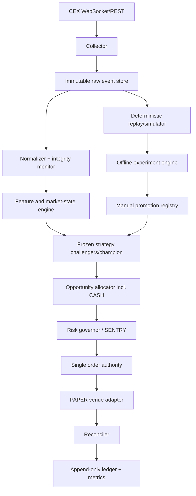

# 03 — Architecture

## Architectural style

AUTOTRADE 8.0 is an event-driven modular monolith at bootstrap. Separate processes are permitted only where failure isolation or credential isolation justifies them. Microservices would add operational cost without creating alpha.

The architecture has four planes:

1. **Truth plane** — raw market/account events, sequence validation, time, and immutable storage.
2. **Evidence plane** — replay, simulation, feature computation, research, and challenger validation.
3. **Decision plane** — frozen strategy, opportunity comparison, CASH decision, and risk gates.
4. **Execution plane** — PAPER orders, reconciliation, state machine, and audit ledger.

## Component flow

## Core components

| Component | Owns | Must not own |
|---|---|---|
| Collector | connections, raw payloads, receive timestamps | indicators, signals, orders |
| Integrity monitor | gaps, staleness, skew, schema status | filling missing market facts |
| Normalizer | canonical event types and units | strategy-specific features |
| Market-state engine | causal features and snapshots | promotion or execution |
| Strategy runtime | frozen hypothesis evaluation | position sizing, credentials |
| Allocator | comparable opportunity ranking and CASH | order submission |
| Risk governor | limits, exposure, leverage ceiling, halts | alpha estimation |
| Order authority | idempotent order lifecycle | strategy research |
| Venue adapter | venue protocol and rule normalization | portfolio decisions |
| Reconciler | venue truth vs local truth | silent state correction |
| Ledger | append-only financial and decision events | mutable business state |
| Replay/simulator | decision-time reconstruction and fills | access to final holdout during tuning |
| Experiment engine | offline candidate generation/evaluation | modifying running artifacts |
| Promotion registry | lifecycle and manual approvals | automatic promotion |
| Dashboard | projection and controlled commands | authoritative state or direct orders |

## Dependency rules

- Domain models do not import venue SDKs, dashboards, or storage engines.
- Strategy modules depend on canonical data contracts only.
- Risk depends on canonical positions/account state, never dashboard state.
- Execution accepts only approved intents from risk governor.
- Research and runtime share schemas and feature definitions, but not mutable state.
- Simulation uses the same strategy/risk interfaces as PAPER.
- Dashboard commands enter through authenticated command handlers and the audit ledger.

## Time model

Every event records:

- exchange event timestamp;
- local monotonic receive time;
- normalized UTC timestamp;
- sequence or snapshot watermark;
- processing timestamp; and
- clock-health state.

Business decisions use event time. Timeouts and health use a monotonic clock. Wall-clock rollback must not make stale data look fresh.

## State ownership

The authoritative runtime state is rebuilt from:

1. venue account/open-order/position snapshots;
2. append-only local ledger;
3. active signed configuration; and
4. raw event watermarks.

Caches and dashboards are disposable projections.

## Startup sequence

1. Load and verify code/config/strategy manifests.
2. Start in `BOOTSTRAPPING`, unarmed.
3. Establish market and account feeds.
4. Validate instrument rules and clock health.
5. Reconcile balances, orders, fills, and positions.
6. Warm required causal features without backfilling across gaps.
7. Enter `READY_UNARMED` only when every hard gate passes.
8. Require explicit PAPER arm action.

## Shutdown sequence

Graceful shutdown blocks new intents, persists watermarks, drains/records in-flight events, reconciles account truth, and records final state. Process termination never assumes positions are flat.

## Framework policy

Potential libraries are implementation candidates, not architectural authorities:

- NautilusTrader may provide deterministic event-driven research/execution primitives.
- Hummingbot may be mined for connector and market-making/carry implementation patterns, not used as a second order authority.
- Optuna may search bounded offline parameter spaces after multiple-testing controls are defined.
- River may support research on streaming adaptation, but online mutation of the PAPER champion remains forbidden.
- TensorTrade/RL is deferred because it increases overfitting and simulator-dependence before market truth is established.

Adoption requires an explicit ADR covering version pinning, license, attack surface, failure behavior, and removal path.
