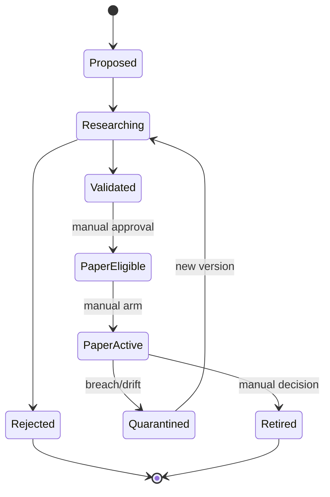

# 07 — Research and Validation

## Principle

The purpose of research is to kill weak ideas cheaply. It is not to manufacture a green backtest.

## Hypothesis contract

Before computing results, register:

- economic mechanism;
- eligible instruments/regimes;
- decision timestamp and horizon;
- causal inputs/features;
- entry, exit, expiry, and invalidation;
- cost/fill model level;
- parameter search space;
- primary metric and failure metrics;
- validation splits and purge/embargo logic;
- null/baseline comparisons;
- minimum sample/effective sample plan; and
- retirement conditions.

Changing the hypothesis after results creates a new hypothesis ID.

## Dataset separation

| Dataset | Purpose | Access rule |
|---|---|---|
| Development | implementation and debugging | reusable |
| Selection | parameter/model selection | reusable with experiment logging |
| Validation | confirm selected design | limited iterations |
| Test | final pre-holdout check | access counted |
| Sealed holdout | final unbiased estimate | one declared access per candidate generation |

Repeated holdout access contaminates it. The registry records every access and requires a new future period when contaminated.

## Chronological validation

- Never random-shuffle time series.
- Use rolling/anchored walk-forward folds.
- Purge observations whose labels overlap the test boundary.
- Embargo the period required by feature/label dependence.
- Split by event time and preserve receive-time causality.
- Include bull, bear, sideways, high-volatility, low-liquidity, and outage-like regimes when available.

## Required baselines

Every strategy competes with:

- CASH;
- random eligible selection with identical holding/cost rules;
- simple buy/short or naive rule appropriate to the hypothesis;
- previous champion if one exists; and
- an ablated strategy without each major feature.

## Metrics

Primary:

- net expectancy after pessimistic costs;
- confidence interval for expectancy;
- max drawdown and tail loss;
- profit factor;
- exposure time; and
- probability of loss/ruin under resampling.

Supporting:

- win rate and payoff ratio together;
- turnover and cost share of gross edge;
- calibration error;
- performance by regime/instrument;
- parameter-neighborhood stability;
- data/execution rejection rate; and
- effective independent sample size.

Win rate alone has no promotion value.

## Multiple-testing defense

- Log the number of trials and search space.
- Compare chosen results with a random-pick null.
- Use sign-flip/bootstrap nulls where assumptions permit.
- Report probability of backtest overfitting or equivalent selection-bias measure.
- Prefer broad stable parameter regions over isolated peaks.
- Penalize complexity and turnover.
- Treat Optuna or any optimizer as a generator of multiple hypotheses, not proof.

## Minimum promotion evidence

Numeric sample thresholds remain alpha-family-specific and must be fixed before testing. Regardless of sample count, a candidate cannot advance unless:

1. net expectancy is positive in aggregate and not driven by one trade/instrument;
2. validation/test/holdout agree in sign within uncertainty;
3. pessimistic cost and latency stress do not destroy the edge;
4. no obvious leakage is found;
5. ablation supports the claimed mechanism;
6. drawdown/tail loss satisfy the risk policy;
7. the strategy beats relevant baselines; and
8. the complete evidence bundle is reproducible.

## Lifecycle

There is no LIVE state.

## Evidence bundle

Promotion review receives:

- hypothesis and search-plan manifests;
- dataset/provenance hashes;
- code/config/environment hashes;
- fold-level results and all trials;
- cost and stress decomposition;
- baselines and ablations;
- leakage tests;
- holdout access record;
- known limitations; and
- explicit approve/reject signature.
