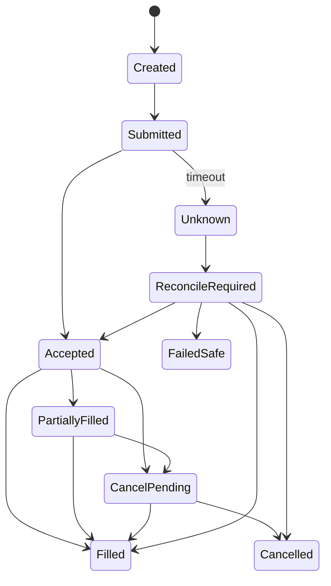

# 10 — Execution, Reconciliation, and State

## Execution principle

The execution subsystem converts an approved intent into PAPER venue actions while minimizing unknown state. It must never reinterpret strategy intent.

## System state machine

```mermaid
stateDiagram-v2
  [*] --> Bootstrapping
  Bootstrapping --> ReadyUnarmed: health + reconciliation pass
  ReadyUnarmed --> ArmedPaper: authenticated arm
  ArmedPaper --> PositionOpen: entry filled
  PositionOpen --> ArmedPaper: position flat + reconciled
  ArmedPaper --> Halted: risk/data/execution trigger
  PositionOpen --> Halted: trigger; protect existing exposure
  Halted --> Probation: eligible manual resume
  Probation --> ArmedPaper: probation completes
  Halted --> Bootstrapping: hard fault recovery/restart
  Bootstrapping --> FailedSafe: integrity cannot be established
```



`HALTED` means no new exposure. Existing positions continue through explicit protection/reconciliation policy; halt is not equivalent to blind market liquidation.

## Order lifecycle



Timeout never means rejected. It means unknown until venue truth is reconciled.

## Idempotency

Client order identity derives from:

```text
arm_epoch / decision_id / intent_version / leg_id / attempt
```

Retries query/reconcile first and reuse the intended identity where venue semantics permit. A process restart cannot create a new logical order for the same intent.

## Pre-submit checks

Immediately before submission:

- system is armed for PAPER;
- decision/intention not expired;
- strategy/version still approved;
- market/account data healthy and fresh;
- instrument tradable and rules current;
- price/quantity rounded correctly;
- minimum notional satisfied;
- risk approval matches current equity/exposure;
- no duplicate/in-flight conflicting order;
- rate-limit capacity available; and
- audit ledger writable.

## Partial fills

Partial fill handling is strategy-independent policy:

- update actual exposure from fills, not requested quantity;
- recalculate remaining risk;
- cancel remainder when timeout/price bound is breached;
- never resubmit blindly;
- for bootstrap single-leg directional orders, protect filled quantity immediately; and
- multi-leg atomicity is deferred with cross-venue strategies.

## Reconciliation

Reconcile on:

- startup/restart;
- connection recovery;
- order timeout/unknown state;
- every fill/cancel/reject;
- periodic heartbeat;
- balance/position discrepancy; and
- before/after any resume.

Compare:

- open orders;
- recent orders/fills;
- net positions and side;
- average entry;
- balances/margin;
- fees/funding; and
- local risk reservations.

Unknown venue positions or orders cause a hard halt. The system records discrepancies and never silently edits history.

## Exit priority

1. Resolve unknown execution state.
2. Prevent exposure from increasing.
3. Maintain/submit protective exit if venue and data truth are valid.
4. Reduce exposure under the declared emergency policy.
5. Escalate for manual intervention if safe automation cannot be established.

## PAPER limitations

Exchange PAPER environments may not reproduce liquidity, funding, rate limits, or fills. Therefore:

- run local counterfactual execution simulation beside PAPER;
- compare both against public market events;
- label synthetic vs venue-provided behavior; and
- do not treat profitable PAPER alone as LIVE evidence.
